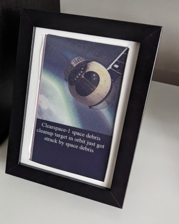
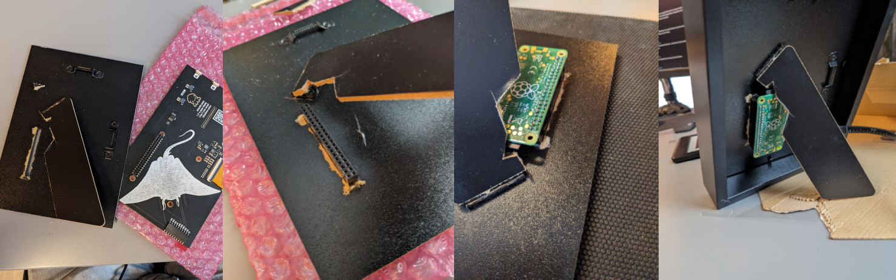
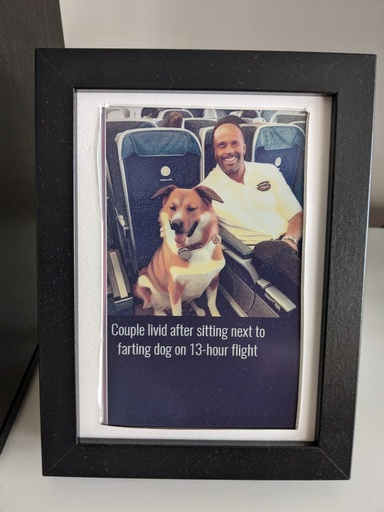
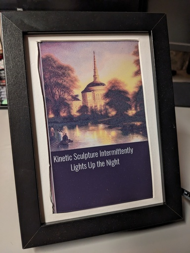
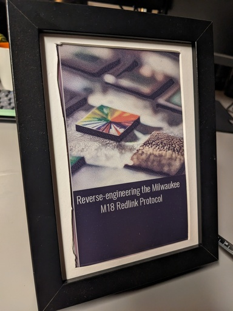
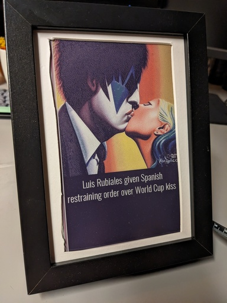

# Auto epaper art




More images in [.github/images/](.github/images/)

This is a self-contained image generation picture frame showing mostly on-topic news headlines and probably only tangentially related images.

The project runs Stable Diffusion on a raspberry pi, showing a image about a semi-random headline every 5 hours. It's a self-contained image generation picture frame showing mostly on-topic news headlines and probably only tangentially related images.

It could be a lot faster with less iteration, but I like images that are time-wise more "expensive". A new image every 5 hours means that there's a new image in the morning, around lunch, around dinner and during the evening.

The generated images aren't saved, it's a physical piece and I like that you have to be there to see it. If you don't want this, remove the line indicated by the comment in [bin/run.sh](bin/run.sh).

It's fun to guess what the neural nets might have latched on to; Wednesday the day or Wednesday the character? The image generation isn't very good, adding its own interesting twist.

It's a nice way to interact with the news.

Finally, pressing any of the four buttons on the e-paper HAT will toggle the display between the generated image and a QR code linking to the headline.

## Generation sources

Headlines are sourced from
- CNN
- BBC World
- DutchNews
- 9gag
- The nottheonion subreddit
- The gaming subreddit
- The onion
- Hackaday

The sources are chosen to be a nice mix of actual news and random funny bits. They're combined with some random prefixes and suffixes to hopefully make the images interesting.

See `src/prompt_sources.py` for sources and how to add your own.

## Hardware

- IKEA picture frame
- Raspberry pi zero 2 w
- Inky Impression 7.3" (7 colour ePaper/E Ink HAT) https://shop.pimoroni.com/products/inky-impression-7-3

Keep the thermals in mind, the rpi zero is kept busy and pulls a couple of watts. It needs some (passive) airflow, don't put it into the enclosure without any additional cooling. I put it on the outside and that seems to be working fine.

## Installation

### Clone this repo

Clone the repo into ~/epaper-slow-generative-art, or update the location in the user cronjob if you don't.

### Install stable diffusion that works with low amounts of RAM

- Follow the OnxxStream installation instructions, OnxxStream will end up in `<this dir>/OnxxStream`, XNNPACK will end up in `<this dir>/XNNPACK`. https://github.com/vitoplantamura/OnnxStream **compile OnxxStream with `-DMAX_SPEED=ON`, or reduce steps from 28 to 10 in `run.sh`**
- Put the weights from https://github.com/vitoplantamura/OnnxStream/releases in `<this dir>/weights`
- Using a virtualenv is recommended. To do this, run
  - `pip install virtualenv`
  - `virtualenv venv`
  - `source venv/bin/activate`
- Install required python packages with `pip install -r requirements.txt`

### Increase swap

- `sudo dphys-swapfile swapoff`
- `sudo vim /etc/dphys-swapfile`, set `CONF_SWAPSIZE=1024`
- Re-init swap with `sudo dphys-swapfile setup`
- Turn the swap on again with `sudo dphys-swapfile swapon`

### Install root cronjob

```
55 5 * * * reboot
```

### Install user cronjobs
```
PATH=/usr/local/sbin:/usr/local/bin:/usr/sbin:/usr/bin:/sbin:/bin:/usr/local/games:/usr/games

@reboot cd epaper-slow-generative-art && ./bin/handle_button_presses.sh >> /tmp/buttons.log 2>&1
0 6,11,16,21 * * * cd epaper-slow-generative-art && /usr/bin/flock -w 0 ./bin/run.sh ./bin/run.sh >> /tmp/generate.log 2>&1
```

## Results

[](.github/images/result-1.jpg)
[](.github/images/result-2.jpg)
[](.github/images/result-3.jpg)
[](.github/images/result-4.jpg)
[](.github/images/result-5.jpg)
[](.github/images/result-6.jpg)
[](.github/images/result-7.jpg)
[](.github/images/result-8.jpg)
